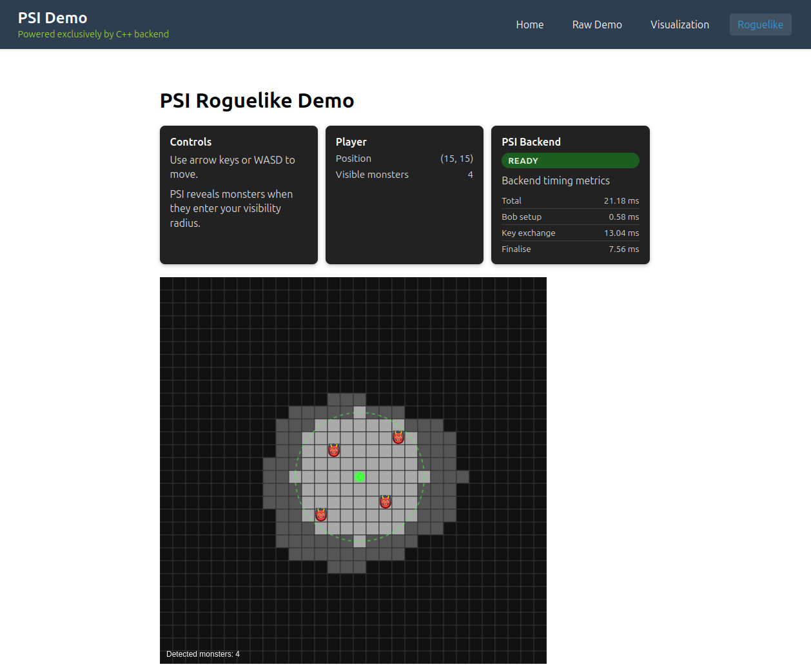

# Private Set Intersection (PSI) C++

C++ port of the PSI protocol reference implementation, built on libsodium (ristretto255, XSalsa20-Poly1305) and the Blake3 C implementation, with deterministic tests, CLI tooling, and an HTTP endpoint for UI integration.

The project follows the four-phase workflow of the JavaScript demo (`reference/psiCalculation.js`) but deliberately diverges from it cryptographically: the JS version hashes elements to the curve as `H(x)·G` (a known discrete log, which lets one participant enumerate the other's set offline) and sends plaintext elements alongside the blinded values. Both flaws are fixed here; see `docs/security_hardening.md`. The JS demo should be treated as a visualisation aid, not a secure implementation.

The previous version of the code (in JS) is included here, but also separately on GitHub: https://github.com/EdwardAThomson/psi-demo.



## Features
- Hash-to-group via ristretto255 `from_hash` (Elligator 2, unknown discrete log), H2 key derivation, and Blake3-based deterministic random derivation.
- Tag mode by default: Bob sends one-way BLAKE3 membership tags, so finalisation is O(A) hash lookups; the authenticated-secretbox variant remains available (`runPSIProtocol`).
- Wire messages contain only blinded points and fixed-size tags (or authenticated ciphertexts in secretbox mode); no plaintext elements ever leave a party.
- Phase-oriented PSI API (`psi_protocol`) with both newline and JSON serialization helpers.
- `psi_demo`: CLI walkthrough of sample units, printing plaintext values, serialized payloads, and per-phase timings.
- `psi_server`: HTTP service exposing `POST /psi`, returning JSON payloads and timing metrics ready for React integration.
- GoogleTest suite covering helper behaviour, serialization round-trips, PSI flows, and error handling.
- Multi-level grid encoding for visibility cells, mirroring the original JavaScript frontend.
- Web Worker-friendly HTTP layer so browsers stay responsive while the PSI backend runs in C++.

## Building
```bash
cmake -S . -B build
cmake --build build
cd build && ctest   # run tests
```

## Running the CLI Demo
```bash
./build/psi_demo
```

## Running the HTTP Server
```bash
./build/psi_server
```

# listens on http://localhost:8080/psi (POST)

> Sandbox note: opening sockets is blocked in some restricted environments; run the server on an unrestricted machine.

## Running the React Frontend
1. Build or start `psi_server` from the repo root (see above).
2. In a second terminal, launch the C++-only React demo:
   ```bash
   cd reference_cpp_only
   npm install          # first time only
   npm start
   ```
   The app opens at http://localhost:3000 and proxies PSI requests to `http://localhost:8080/psi`. To change the backend URL, set `REACT_APP_PSI_ENDPOINT` before running `npm start` or assign `window.__PSI_SERVER_ENDPOINT__` in `public/index.html`.
3. The legacy JavaScript demo remains in `reference/` if you need the original worker-based fallback.

## HTTP API
### Request
```json
POST /psi
Content-Type: application/json
{
  "bob_units":   [{"id": "u1", "x": 100.0, "y": 100.0}, ...],
  "alice_units": [{"id": "a1", "x": 150.0, "y": 150.0}, ...]
}
```

### Response
```json
{
  "bob_message": {"items": [{"tag": "<base64>"}, ...]},
  "alice_message": {"items": [{"blindedPoint": "<base64>"}, ...]},
  "bob_response": {"items": [{"transformedPoint": "<base64>"}, ...]},
  "intersection": ["450 450", ...],
  "timings_ms": {
    "bob_setup": <double>,
    "alice_setup": <double>,
    "bob_response": <double>,
    "alice_finalize": <double>
  }
}
```

## React Integration Sketch
```js
async function runPsi(bobUnits, aliceUnits) {
  const res = await fetch('http://localhost:8080/psi', {
    method: 'POST',
    headers: { 'Content-Type': 'application/json' },
    body: JSON.stringify({ bob_units: bobUnits, alice_units: aliceUnits })
  });
  if (!res.ok) throw new Error('PSI request failed');
  return res.json();
}
```

## Threat Model
The protocol is private against honest-but-curious participants. A malicious participant can fabricate its input set and use the protocol as a membership oracle: it learns whether any element it chooses to probe with is in the honest party's set, and the honest party cannot distinguish a probe from a genuine input. Set cardinality also leaks from message counts. Binding inputs to prior commitments (dispute resolution) and padding sets to a fixed size are tracked in `ROADMAP.md`.

## Reports & Docs
- `reports/psi_demo_report.md`: sample CLI run with payloads and timings.
- `reports/progress_2025-10-16.md`: daily progress summary.
- `docs/porting_plan.md`: roadmap, milestones, and API references.

## Front-End Variants
- `reference/`: legacy React demo with automatic JavaScript worker fallback.
- `reference_cpp_only/`: C++-only React demo that forwards PSI requests through a lightweight Web Worker to the backend, exposes server timings in the UI, and refuses to fall back to the original browser implementation.

## Licenses
Refer to upstream libraries for their respective licenses (libsodium, Blake3 C implementation).
